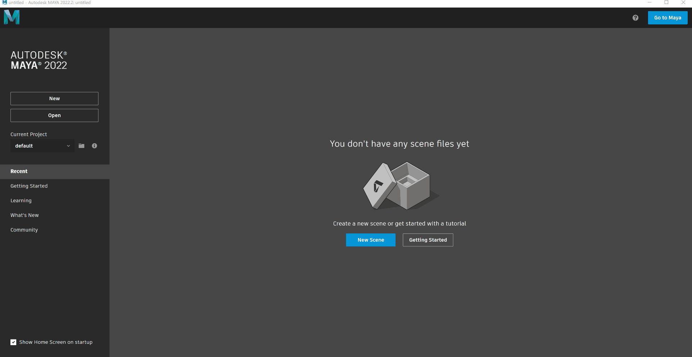

# Project Setup 

## Description

This tool can be used to save maya scenes with automatic version increments. 
If the current maya scene has never been saved or was saved with an invalid name then it will be saved to the project directory with the following naming: 
{asset_name}.{asset_type}.{username}.1.ma 

Otherwise, if a file already exists with a valid name, the tool will increment the version number and save it to the current directory.

Asset name, Asset Type and Project Directory can be set in Environment Variables or using the PowerShell alias located at etc/aliases.ps1

## Additional Instructions

- To Install aliases in Powershell use the **Import-Module etc/aliases.ps1** command.

To set the asset name, asset type or project directory use the *asset* alias.

***For Example:*** 

    Import-Module .\etc\aliases.ps1
    asset -AssetName Robin -AssetType Character -ProjectDir $PWD\bin

**Note:** To permanently install the alias copy the commands in aliases.ps1 to $PROFILE for use in Powershell.   

- To install the tool as a button in the tools shelf in Maya, copy the `shelf_Tools.mel` file to the Maya's prefs folder: `Documents\maya\<version>\prefs`

## Example 
**Note:** Set the asset alias in powershell, and then click on the Python icon in the "Tools" shelf in maya to use the tool.

    asset -AssetName Robin -AssetType Character -ProjectDir $PWD\bin

Now, anytime when saving the maya scene use the tool in the Tool Shelf or copy the python code and run it in script editor in Maya. 

For the above input the file will be saved as:

    C:\Users\Divyansh Mishra\Desktop\Drexel University\Fall 22-23\ANIM T380\-anim-t380-2022-assignments\assignment-4\bin\Robin.Character.Divyansh Mishra.1.ma

Subsequent saves will be saved as:

    Robin.Character.Divyansh Mishra.2.ma
    Robin.Character.Divyansh Mishra.3.ma
    .
    .
    .
    and so on

