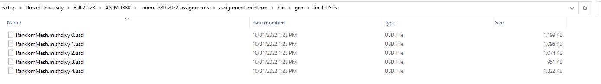
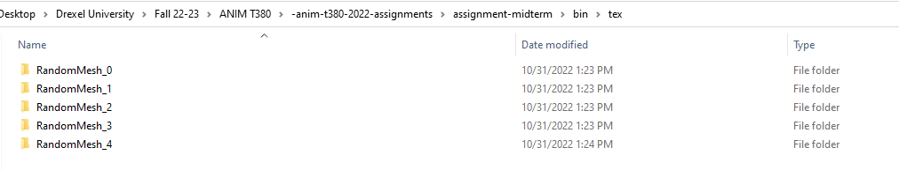
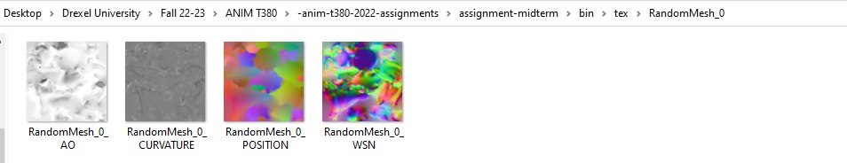

# Automation using PDG and SAT

## Description

This project provides a way to bake texture maps for a mesh in Houdini using Substance Baker. Substance Baker is faster and more reliable than the maps baker that ships with Houdini.

This project also provides an example workflow for creating a batch of fbx meshes, then automatically bakes textures for the meshes using Substance Automation Toolkit (SAT). The script also creates a convex hull collider for the fbx mesh and then saves the mesh with collider as USD (Universal Scene Description) files and saves the baked textures separately.

## Project Structure

- **bin:** This folder contains the binary file including Houdini Scene and HDAs output geometry and texture sets.

    - **geo:** This folder contains the final USD files and intermediate fbx files (if generated).
    - **otls:** This folder contains the Substance Baker HDA and Sample Mesh Generator HDA
    - **tex:** This folder contains all the baked texture sets for each mesh.
    - **Pipeline.hipnc:** This Houdini Project contains the PDG graph that is called by the Python Script.

- **python:** This folder contains all the python files for the Substance Baker HDA and the workflow example.

## Requirements

- Houdini 18.0 or above.
- Substance Automation Toolkit (SAT)

## Installation

1) Add the directory that contains *hython3.7.exe* to the **PATH** variable. 

    For example: ```C:\Program Files\Side Effects Software\Houdini 19.0.561\bin```

2) Install Substance Automation Toolkit using hython.

    For example: ```hython -m pip install Pysbs-2019.2.3.zip --find-links "C:\Program Files\Allegorithmic\Substance Automation Toolkit\Python API" ```

3) Run the ```install.bat```. This will install and setup the Substance Baker HDA for the default Houdini version.

## Arguements
- `--seed`: This changes the global seed that is used by the Random Mesh Generator HDA. Default is 1234.0.

- `--num_meshes`: This sets the total number of meshes to be created. Default is 10.

- `-d` or `--delete`: Set this to 1 if you want to automatically remove all the intermediate fbx files. Default is set 0.

- `-r` or `--output_res`: This sets the output resolution of the textures baked for each asset. Default is set to 10.
        
        10 = 1024 X 1024
        11 = 2048 X 2048
        12 = 4096 X 4096
        13 = 8192 X 8192

## Example 

        hython main.py -r 10 --seed 1235 --num_meshes 5 -d 1

The command above will generate five USD files that each contain a different mesh with a collider (proxy geometry). It will also generate Curvature, Position, World Space Normals, and Ambient Occlusion Maps of 1024 X 1024 resolution for each asset. It will delete all the intermediate .fbx files.








**Note:** The Substance Baker SOP HDA can be used independently in Houdini for baking textures for different meshes manually.


